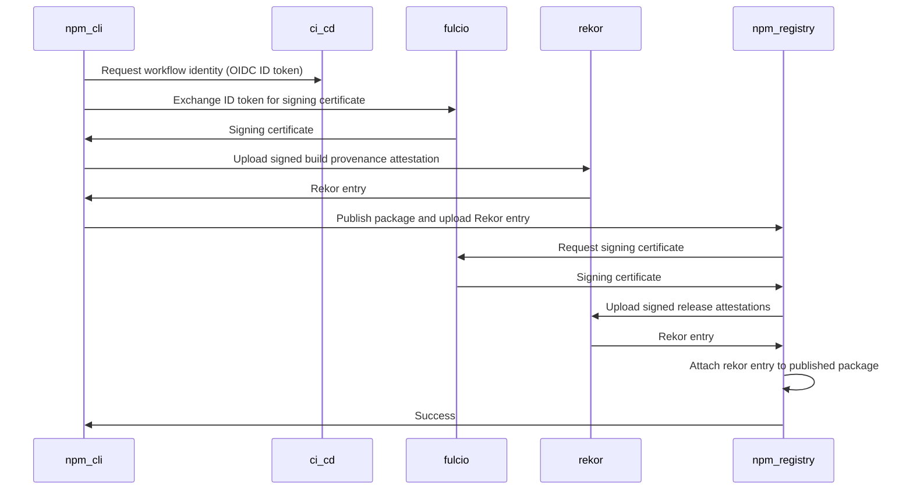

# Link npm packages to the originating source code repository and build

**Authors**: @feelepxyz @kommendorkapten @trevrosen

## Summary
Link public npm packages to the source code repository and build it originated from, making it harder to execute package hijacking attacks where a malicious version of an existing open source package gets uploaded to the registry.

Check out the [glossary](#glossary) for an overview of the different tools, terms and techniques covered in this RFC document.

## Motivation
So far our supply chain security offerings have focused on remediation - patching known vulnerabilities in dependencies (e.g. `npm audit`). The majority of vulnerabilities are accidental, so that was the right place to start. Now we need to turn our attention to deliberate supply chain attacks. In 2021, we saw these types of attacks increase by a terrifying [650%](https://www.sonatype.com/resources/state-of-the-software-supply-chain-2021).

In November of last year alone, we saw three supply chain attacks against popular npm packages ([UAParser.js](https://www.esentire.com/security-advisories/npm-library-supply-chain-attack), [Command-Option-Argument](https://www.esentire.com/security-advisories/coa-npm-supply-chain-attack), and [rc](https://www.esentire.com/security-advisories/rc-npm-supply-chain-attack)), each with millions of downloads per month.

The following chart illustrates several attack vectors facing the supply chain (src: [SLSA](https://slsa.dev/)):


Our focus is on mitigating package hijacking attacks where packages are built from a modified source (C) in the above diagram. This is where a malicious version of an existing open source package gets uploaded to the registry. These maliciously crafted versions are rarely reflected in the canonical source code repository and uploaded directly from an attacker's machine.

The [above](https://www.esentire.com/security-advisories/npm-library-supply-chain-attack) [attacks](https://www.esentire.com/security-advisories/coa-npm-supply-chain-attack) [are](https://www.esentire.com/security-advisories/rc-npm-supply-chain-attack) examples of this, and they frequently occur due to compromised npm credentials but can also happen due to compromised CI/CD or builds.

Code on GitHub, GitLab etc can be browsed and audited, but packages in the registry are opaque and much harder to vet. If packages are built and published in the open these attacks become a whole lot harder. However, right now there’s no way of knowing where a package came from when you retrieve it from the registry.

We want to solve the problem of npm packages being disconnected from their source by linking the published package to the source code repository and build that it originated from.

Once a package includes provenance information (where and how it was built) we can start showing this when browsing a package on the npm registry. You would be able to click through to the particular commit and build that published a given version:


Developers consuming open source packages should get the benefit of this without any changes to their workflows. To begin with, the package integrity should be verified when running the  `npm audit signatures` command and eventually transparently integrated into `npm install` and enabled by default.

Open source maintainers must be able to link their packages to the source and build it originated from with near-zero initial and ongoing overhead.

## Goals
- Establishes a verifiable link between a public npm package and the source repository and build it originated from.
- Does not expose any Personally identifiable information (PII) about maintainers, e.g. emails.
- Avoids developer-managed keys (as there's no good way to offer trust to the community given the challenges of distributing public keys). This, along with opt-in signing, adds near-zero initial and ongoing overhead for open source maintainers.
- Maintainers can opt-in to linking their packages to the source and build it originated from when publishing using `npm publish` for public packages.
- Incentivizes maintainers to build in the open because of the strong guarantees that this offers.
- Verification happens transparently on `npm install` without the need to obtain or manage additional tools or keys.
- Verification should have a negligible performance impact on `npm install`.
- Verification should be performed without depending on any third-party systems other than the registry.
- Compatible with third-party npm clients, e.g. `yarn` and `pnpm`.
- Should allow third-party npm registries, e.g. GitHub Packages, Artifactory and Verdaccio to follow suit and implement similar interfaces.
- Should be maintained with >99.9% uptime so that developers are not blocked from publishing new packages.
- Should allow future extensions to support centrally managed signing authorities such as certificates managed by an enterprise and inner source within air-gapped enterprise environments.
- Buy-in from the broader open source community.

## Non-goals
- Support for private/inner-source packages to begin with.
  - Our primary goal is to link packages hosted on the npm registry to the source and build it originated from, for this to be broadly useful, the source code and build need to be publicly available. We're committed to eventually supporting private use cases.
- Support for self-hosted CI/CD systems.
- Mitigate every possible supply chain attack against the npm registry. For example:
  - Registry/mirror/proxy MITM attacks
  - Denial of service attacks against the registry or client from a compromised mirror/proxy
    - Rollback/fast-forward attacks (e.g. providing the wrong version for update)
    - Freeze/endless data attacks (e.g. preventing updates)
    - Extraneous dependencies attacks (e.g. tricking the client to install undeclared dependencies)
  - Malicious maintainer (e.g. [event-stream](https://blog.npmjs.org/post/180565383195/details-about-the-event-stream-incident))
  - Compromised login credentials (where 2FA can help)
  - Typosquatting attacks (e.g. `lodahs`), [“dependency confusion”](https://medium.com/@alex.birsan/dependency-confusion-4a5d60fec610)
  - Accidental vulnerabilities

## Sigstore as signing solution
The [Sigstore](https://www.sigstore.dev/) project has been selected as the solution to signing npm packages (see detailed explanation below). It is currently the only working solution that supports our key requirements:
- Links packages hosted on the npm registry to the source and build they originated from (provenance information).
- Supports signing identities that don't expose any personally identifiable information (PII) about maintainers, e.g. emails.
- Avoids developer-managed keys (as there's no good way to offer trust to the community given the challenges of distributing public keys).

Note that nothing in this current proposal precludes us from offering additional signing methods in the future as they become available and mature.

## Risks of adopting Sigstore
Sigstore infrastructure and tooling are currently not considered production ready and are run on a best-effort basis. The Sigstore project is working towards a [General Availability](https://blog.sigstore.dev/an-update-on-general-availability-5c5563d4e400) release later this year but we don't yet know what these guarantees will look like yet.

As such, there are several risks of adopting Sigstore for npm that are worth calling out:
- No buy-in from the broader open source npm community.
- Sigstore's public and free-to-use infrastructure is not able to meet our uptime requirements (>99.9%).
- Sigstore is not able to secure the funding required to run the infrastructure with production-grade support, SLOs, and on-call rotation.

To mitigate some of these risks, GitHub is planning to work directly with Sigstore to define and support robust production-grade SLOs for uptime and reliability that meet the requirements for npm. This will involve being on-call and wearing the pager for production services.

In addition, GitHub is planning to support Sigstore by:
- Running a signed timestamp authority for Rekor as well as a Certificate Transparency monitor for Fulcio. This will help spread the trust outside the four walls of Sigstore.
- Maintaining the Sigstore trust root and having a root key holder as part of the group of Sigstore root key holders.

The details around these commitments are still in process of being solidified. The current plan is to commit to this for the foreseeable future as long as npm and/or GitHub is relying on Sigstore services. GitHub would be communicating any changes to these commitments.

We also remain open to an alternative solution if Sigstore is not able to meet npm's requirements for uptime and support.

## Detailed Explanation
### Sigstore as a solution to package signing
Package signing is a mitigation for package hijacking attacks. If maintainers sign their packages, end-users can verify that packages were produced by their corresponding owners. However, as of today, the main existing solution involves maintainer-managed PGP (or similar) keys, which has known [usability](https://www.usenix.org/legacy/events/sec99/full_papers/whitten/whitten.ps) [and](https://latacora.micro.blog/2019/07/16/the-pgp-problem.html) [security](https://blog.cryptographyengineering.com/2014/08/13/whats-matter-with-pgp/) [issues](https://www.wired.co.uk/article/efail-pgp-vulnerability-outlook-thunderbird-smime): registries that have implemented public key signing have seen either limited adoption or achieved adoption only by mandating it (e.g., Maven Central, which reports developer friction).

[Sigstore](https://www.sigstore.dev/) is a promising alternative: it allows signing artifacts with short-lived “disposable/ephemeral keys” notarized against log-ins with [OpenID Connect](https://openid.net/connect/) (OIDC) identities (e.g., Google or GitHub accounts).

Several package ecosystems have announced interest in adopting Sigstore as a way for maintainers to sign packages (e.g., [PyPI](https://pypi.org/project/sigstore/), [RubyGems](https://github.com/rubygems/rfcs/pull/37), [Maven Central](https://blog.sonatype.com/maven-central-and-sigstore)). [OpenSSF](https://blog.chainguard.dev/sigstore-statement-for-openssf-call/) is also working to standardize on Sigstore for signing software.

However, adopting something like Sigstore raises several major questions (beyond the risks detailed above):
- What security benefits does Sigstore provide?
- How should maintainers authenticate to sign packages? The solution should provide both high assurance in the authenticity of packages and respect maintainer privacy.

#### What security benefits does Sigstore provide?
[Sigstore](https://www.sigstore.dev/) is a collection of tools and services aimed at making it easy to use short-lived, ephemeral certificates to sign software.

Sigstore has three main components: a CLI tool (Cosign), a Certificate Authority ([fulcio.sigstore.dev](https://docs.sigstore.dev/fulcio/overview/)), and a time stamping and immutable ledger service ([rekor.sigstore.dev](https://docs.sigstore.dev/rekor/overview/)).

The Cosign functionality will be embedded directly in npm CLI, so we're left with the public [fulcio.sigstore.dev](https://docs.sigstore.dev/fulcio/overview/) (CA) and [rekor.sigstore.dev](https://docs.sigstore.dev/rekor/overview/) (ledger) services.

##### What does [fulcio.sigstore.dev](https://docs.sigstore.dev/fulcio/overview/) give us?
- Independent party to validate claims of the OIDC identity token which contains references back to the repo, workflow run and git SHA.
- A supported CI/CD provider can't falsify these claims and no one else can claim to be one of these CI/CD providers.
- The npm build script can't forge the source provenance by, for example, saying it's from some other repo or git SHA.
- Vendor-neutral: can support any standards-compliant OIDC Identity Provider that can meet their requirements.

##### What does [rekor.sigstore.dev](https://docs.sigstore.dev/rekor/overview/) give us?
- Verifies that the signing happened during the time the certificate was valid and that the response from [Rekor](https://docs.sigstore.dev/rekor/overview/) is signed and can be verified offline.
- Verifiable, append-only ledger, makes it hard to tamper with already signed packages.
- Verification won't rely on [Rekor](https://docs.sigstore.dev/rekor/overview/) as we'll store detached signatures on the registry for performance and reliability but it adds an extra layer of protection in case of registry compromise.

#### How should maintainers authenticate to sign packages?
[Sigstore](https://www.sigstore.dev/) issues short-lived “disposable keys” notarized against log-ins with OIDC identities. So what OIDC identity provider (IdP) do maintainers use?

This has been the subject of some controversy; for instance, in the [proposal to add Sigstore signing to RubyGems](https://github.com/rubygems/rfcs/pull/37), users worried about “vendorization” (making the repository reliant on third parties to function, e.g. GitHub, Google or Microsoft) and privacy (some maintainers are pseudonymous; Sigstore certificates include email addresses by default when signing using the [cosign](https://github.com/sigstore/cosign) CLI tool).

Sigstore supports both email and CI/CD workload-based OIDC identities:

##### Email based identity provider
For instance, Google, GitHub, Microsoft (supported by Sigstore today) or any other IdP that Sigstore might support.

**Pros**
- Separate party for trust: it would be difficult for an attacker to compromise the repository and one of these IdPs.
- Many (but not all!) users have these accounts already.
- Portable: supports publishing from most environments (requiring a browser and an IdP login).
- Minimal changes to existing publish workflow for maintainers that are publishing directly.
- Reliability: these IdPs already work at scale and have full-time support.

**Cons**
- Privacy: the identities used to sign packages are public (though users can make a pseudonymous account).
- Privacy: Only a handful of identity providers are supported today that might not suit all users (GitHub, Google or Microsoft).
- Security: Some users might only have secondary, less secure, accounts on one of the supported services making it an easier target.
- Does not include provenance information about where the release came from and how it was built.
- The email might not match the one used on the registry making it hard to validate that it's from a legitimate maintainer.

##### CI/CD workload identity provider
For instance, Github Actions (supported by Sigstore today) or any other CI/CD system that can provide OIDC workload identities with required claims.

**Pros**
- Support for pseudonyms/privacy: does not require public identities other than what already corresponds to the package (e.g. repository).
- Links the package to the source repository and includes information about and how it was built: commit SHA, workflow run id etc.
- Vendor-neutral: supports any CI/CD system supporting OIDC workload identities.
- OIDC workflow identities could also be used to authenticate the package publish (restricting publishing to a specific source code repo and removing the need for long-lived access tokens).

**Cons**
- Limited support today: Only GitHub Actions is fully supported in Fulcio today.
- Friction: Requires publishing from supported CI/CD providers.
- CI/CD providers will need to operate an IdP and get it integrated with Sigstore.

Using workload identities along with short-lived X.509 certificates is currently the only solution that meets our key requirements:
- Linking packages to the source and build.
- Doesn't expose any personal identifiable information about maintainers.
- Avoids developer-managed keys by placing trust in the CI/CD identity provider.

Today this means only commercial CI/CD providers will be supported. This is far from where all developers are publishing today so this will add friction and slow adoption. All major CI/CD providers offer free plans for Open Source projects and we hope that all packages will eventually be built out in the open to make supply chain attacks harder to execute.

### Threat model
Our threat model focuses on package hijacking attacks: where a developer with good intentions, writing secure code (i.e. no accidental vulnerabilities) publishes this package to the npm registry.

The attacker might then gain access to the maintainers login credentials and upload a modified version of the package to the registry under a different, in-range version number causing end-developers who depend on this package to consume malicious code. This maliciously crafted package is often not reflected in the package's source code repository and uploaded directly from the attacker's machine.

This proposal does not mitigate against compromised npm login credentials. The aim is to make it harder to execute these types of attacks by creating a public audit trail for where, how and who published a package. Over time the presence of this information can be enforced.

As such, what we care about in this threat model is whether this provenance information can be forged and whether verification can be bypassed.

The following table highlights the impact of different compromises:

| Compromised infrastructure | Forge provenance                 | Bypass verification |
|----------------------------|----------------------------------|--------------------|
| npm registry               | No                               | Yes                |
| CI/CD                      | Yes                              | No                 |
| Sigstore                   | Yes                              | No                 |
| Network (MITM)             | No                               | Yes                |
| User account (npm)         | No                               | Yes                |
| User account (GH)          | No                               | No                 |
| Trusted builder            | Likely                           | No                 |

An attacker could forge what goes in the provenance information if the CI/CD provider or Sigstore was compromised. Similarly, if the trusted builder was compromised in some way it's likely the attacker could forge the provenance information during the build. Mitigating these attacks is out of scope in this proposal.

An attacker could bypass verification if the npm registry, npm user or the network was compromised by not providing provenance information or removing it in transit.

The long-term solution to bypassing verification is enforcing or requiring that all packages have provenance information set during install time in the npm CLI. It might take years to get to the point where a large portion of npm packages have this information set so we'll need to find ways to get there gradually.

We could make it harder to remove provenance information once it's been set by a maintainer. For example, blocking a npm publish that doesn't include it if the current latest version does include it. Requiring user 2FA to remove it once it's set.

Maintainers and developers consuming packages could also opt-in to requiring all their dependencies to include provenance information once their dependencies include this.

## Rationale and Alternatives
While no existing solution addresses all of the goals outlined above at this time, the [Sigstore](https://www.sigstore.dev/) project and its use of short-lived X.509 certificates is closest to our stated goals for the vast majority of developers since it reduces the complexity of key management, and removes the need for revocation scenarios.

Using OIDC to handle authentication of workloads requesting a short-lived X.509 certificate allows this solution to be vendor neutral and work consistently across many source repositories and CI systems.


### Signing methods
#### Author managed keys
The most common existing solution to signing software involves maintainer-managed keys, which has known [usability](https://www.usenix.org/legacy/events/sec99/full_papers/whitten/whitten.ps) [and](https://latacora.micro.blog/2019/07/16/the-pgp-problem.html) [security](https://blog.cryptographyengineering.com/2014/08/13/whats-matter-with-pgp/) [issues](https://www.wired.co.uk/article/efail-pgp-vulnerability-outlook-thunderbird-smime). Registries that have implemented public key signing have seen either limited adoption or achieved adoption only by mandating it (e.g., Maven Central, which reports developer friction).

Distributing author-managed public keys (PKI) remains a challenge as well as guaranteeing secure handling of private key material. Leaked credentials are a widespread problem among existing PKI implementations, as evidenced by the large number of SSH keys that both [independent researchers](https://www.ndss-symposium.org/wp-content/uploads/2019/02/ndss2019_04B-3_Meli_paper.pdf) and GitHub’s internal secret scanning program have found over the years.

#### Long-lived CI/CD managed keys
The CI/CD system could sign the provenance attestation with its own private key(s). This is something [Google Cloud Build](https://cloud.google.com/build/docs/securing-builds/view-build-provenance) supports today.

One approach would be to use one key per CI/CD system, which would ease key distribution but make it challenging to contain partial key compromises. Another approach would be to use one key-pair per source code repository or project. This limits the blast-radius for each pair but makes key distribution and revocation challenging.

While there is some precedent for this in GCP, there's no paved path or standard for key distribution across CI/CD systems that would scale to the needs of large code repositories like GitLab and GitHub.

#### Long-lived X.509 certificates
Long-lived X.509 certificates are in widespread use to secure web pages, but they are still cumbersome to manage.

Long-lived certificates have the advantage of being able to chain up to a certificate authority that has intrinsic trust, so beyond authenticating that the artifact signed by the certificate is valid, a consumer can validate that the artifact is from an author that they trust.

Like other author-managed keys, the developer must keep and secure the private key throughout the lifetime of the certificate. Long-lived certificates may also encounter issues with needing to manage revocation in the event of a private key leak. While a centralized certificate authority could issue long-lived X.509 certificates to developers as Let's Encrypt has done for web pages, the need to manage revocation across software artifacts in the registry is a problem.

Nuget, for example, supports [CA-issued code signing certificates](https://docs.microsoft.com/en-us/nuget/create-packages/sign-a-package). Its seen low adoption among the open source community due to several reported [problems](https://haacked.com/archive/2019/04/03/nuget-package-signing/).

#### Short-lived X.509 certificates
Short-lived X.509 certificates eliminate the need to manage keys across a long lifetime and eliminate the need to handle revocations.

Combined with a trusted certificate authority that can create short-lived certificates and log the signatures that took place on them, we can validate any artifacts that were signed by that certificate, and protect against repudiation by maintaining an immutable log of the signing activities.

The immutable log can also enforce that the signing certificate was valid when the signature was created by verifying the signed certificate timestamp (SCT) created by the certificate authority.

Compared to other options, this one reduces the friction for developers to sign their artifacts.

## Design considerations

### Supported build flows
Only builds executed inside a build system that supports OIDC workload identities with a custom audience will be able to create and sign provenance attestations (source and build info). All build providers that meet these requirements will be supported.

Today, this means adding direct vendor support for commercial CI/CD vendors. We realize that this isn't ideal as it centralizes support to a handful of vendors. We believe this compromise is the best option we have given our goals around building and publishing in the open, respecting maintainer pseudonymity and avoiding maintainer-managed keys or secrets.

### Authorizing a release
A provenance attestation captures information about the source code repo, revision and build information. This information on its own does not capture if the release was accepted by the registry as coming from an authorized user.

While inclusion in the registry is proof that the package was published by an authorized actor, no verifiable attestation exists that captures the details of the decision taken by the registry to allow the publish step.

As part of authorizing publishing of the package, the registry should sign a statement (release attestation) about accepting the package release and publish it to Rekor (public ledger).

WebPKI CAs currently use a similar approach when they publish all issued certificates to a [transparency log](https://certificate.transparency.dev/).

### CI/CD OIDC provider support
Today only GitHub Actions is fully supported by Fulcio. We’d like to see support added for any public CI/CD service that can meet these requirements:
- OIDC ID tokens identifying the current workflow/run/build.
- ID token with a custom audience (needs to be set to `sigstore` for Fulcio to accept it).
- Claims about the code repository, commit, build and actor (see a detailed table of required ID token claims below)

As of today, Google Cloud Build supports custom claims but neither GitLab Pipelines nor CircleCI offers this. [GitLab](https://gitlab.com/gitlab-org/gitlab/-/issues/356986) is planning to add support for a custom audience.

The plan is to start with direct vendor support in Fulcio. Fulcio will need to be patched to produce certificates containing custom claims data from Circle CI, GitLab and Google Cloud Build.

We will also work with OpenSSF and other package ecosystems adopting [Sigstore](https://www.sigstore.dev/) on an official claims set that any provider can implement. Once we have this each vendor could be added to Fulcio by simply specifying the standard OIDC client configuration.

#### Comparison of OIDC ID token support across CI/CD systems

| Name               | OIDC ID token | Custom audience | Comment                                                                                                                                                                |
|--------------------|--------------|-----------------|------------------------------------------------------------------------------------------------------------------------------------------------------------------------|
| GitHub Actions     | yes          | yes             | Uses “workflow run” as the subject                                                                                                 |
| GitLab Pipelines   | yes          | no              | Subject is the project path. See [documentation](https://docs.gitlab.com/ee/ci/variables/predefined_variables.html).                                                                                                                   |
| CircleCI           | yes          | no              | Uses [workload ID](https://circleci.com/docs/2.0/openid-connect-tokens/) that includes a notion of “user ID” in the Fsubject claim. There is a [feature request to make this configurable](https://circleci.canny.io/cloud-feature-requests/p/customizable-audience-claim-in-oidc-tokens) |
| Google Cloud Build | yes          | yes             |                                                                                                                                                     |
| Bitbucket          | yes          | no              | Is it used for OSS?                                                                                                                                                    |
| TravisCI           | no           | -               | Is it used for OSS?                                                                                                                                                    |
| AWS Cloud Build    | ?            | ?               | Is it used for OSS?                                                                                                                                                               |
| Azure DevOps          | ?          | ?              | Is it used for OSS?                                                                                                                                                    |
| Jenkins          | yes (plugin)     | yes            | It would have to be a hosted public and stable version. Is it used for OSS?                                                                                                                                                    |

#### Comparison of provided and required ID token claims

The following claims are required to fully support generating build provenance for npm releases.

| Claim           | Required                                                                  | GitHub           | GitLab                                  | CircleCI                                                       |
|-----------------|---------------------------------------------------------------------------|------------------|-----------------------------------------|----------------------------------------------------------------|
| Subject         | The repo/project/resource from where the build is running.                | Repository path  | Project path                            | “org/org id  project/project id user/user id”                  |
| Repo            | The git/scm repository from where the build is running.                   | repository       | project_path                            | Only contains the project id, which can be seen as a weak link |
| Repo id         | The ID of the git/scm repository from where the build is running.         | repostory_id     | project_id                              | See above comment on “Repo”                                    |
| Repo ref        | The git/scm reference that triggered the build.                           | ref              | ref                                     | N/A                                                            |
| Commit SHA      | The git/scm sha that triggered the build.                                 | sha              | N/A                                     | N/A                                                            |
| Actor           | The account that initiated the build.                                     | actor            | user_login or user_email                | Need to parse subject claim.                                   |
| Actor id        | The ID of the account that initiated the build.                           | actor_id         | user_id                                 | See above comment on “Actor”                                   |
| Build name      | The name of the build.                                                    | workflow         | pipeline_id (i.e no name, only numeric) | N/A                                                            |
| Build id        | The ID of the build.                                                      | run_id + run_attempt           |                                         |                                                                |
| Build reference | Ref to an external workflow if one is being used, e.g. a trusted builder. | job_workflow_ref | N/A                                     | N/A                                                            |

## Implementation details

There will be two different ways to include provenance information during publish: running the CLI directly on a supported CI/CD system or using the optional but recommended "trusted builder to publish.

- "Sigstore integration in the npm CLI"
  - The npm CLI will include the capability to extract provenance information out-of-the-box on supported CI/CD systems.
  - The provenance information will be extracted from the ENV and ID token provided by the CI/CD system when running `npm publish`.
- "Non-falsifiable provenance using a trusted builder"
  - A reusable workflow or "trusted builder" can be used to invoke the npm CLI, extracting provenance, running install, build and publish in isolated steps, preventing malicious dependencies or build script from tampering with the provenance information.
  - The trusted builder will for example checkout the repo that's in the ID token as well as extract ENV information before any other user supplied commands are executed, passing this information to `npm publish` for signing.
  - Using the trusted builder is recommended but it might not support all possible publish workflows so will be optional.

### Sigstore integration in the npm CLI
Generating build provenance during publish will be opt-in using a command line flag and only run in supported CI/CD systems.

When enabled on publish, the npm CLI will interact with Sigstore directly (after fetching the configured endpoints from the registry): certifying the authenticity of the CD/CD workflow identity token ([fulcio.sigstore.dev](https://docs.sigstore.dev/fulcio/overview/)) and verifying that signing happened during the time the id certificate was valid ([rekor.sigstore.dev](https://docs.sigstore.dev/rekor/overview/)).

The signature will be placed on the public Rekor ledger for transparency but a detached copy will be uploaded to the npm registry and used for verification. The detached copy includes proof that it was verified and included by Rekor so we don't need to query it again during verification.

Signature verification will happen transparently during `npm install` and `npm audit signatures` so needs to meet strict performance and reliability uptime requirements as it will be performed for every single npm install. The provenance attestations/signatures will be fetched in bulk from the registry, similar to how advisories are fetched in bulk for all dependencies in the current install. This means verification will not rely on any Sigstore infrastructure to work.

The signing and verification logic will be implemented in a [sigstore-js](https://github.com/sigstore/sigstore-js) client library using Node.js's crypto library. Similar clients exist in [Go](https://github.com/sigstore/cosign), [Python](https://github.com/sigstore/sigstore-python) and [Java](http://github.com/sigstore/sigstore-java) and we plan to follow their lead on implementation details.

The npm CLI will rely on the Sigstore JS client library to generate the provenance attestation on publish and to verify the detached signature bundle that's downloaded from the registry.

The Sigstore client library will include direct vendor support for requesting an OIDC id token from supported CI/CD systems, similar to the existing client libraries. It will also include all the required functionality to interact with Fulcio and Rekor, as well as verify the [Sigstore root keys](https://github.com/sigstore/root-signing) using a [TUF](https://theupdateframework.github.io/) client.

#### Fetching Sigstore hosts from the configured npm registry
The npm CLI will fetch Sigstore config from the configured npm registry that contains the public Fulcio and Rekor hosts by default:

```
GET https://registry-host.tld/-/npm/v1/sigstore-config

{
  "sigstoreConfig": {
    "fulcioUrl": "https://fulcio.sigstore.dev",
    "rekorUrl": "https://rekor.sigstore.dev",
    "tufRepository": "https://sigstore-tuf-root.storage.googleapis.com",
    "tufRoot": "root.json"
  }
}
```

This would allow future extensions where maintainers can configure the instance being used, making sure the release attestation gets placed on the same Rekor instance as the build attestation. The release attestation will be generated by the registry when the package has been successfully authorized and published.

#### Publishing
Maintainers will need to enable build provenance generation with a command line flag: `npm publish --with=build-signatures` in addition to running it in a supported CI/CD system. The command will error with an error message if this is not run in a supported build system.

Once enabled, the CLI will perform the required steps to generate the provenance attestation and upload this to the public Rekor ledger for transparency and a detached copy that contains proof of inclusion from Rekor will be stored in the npm registry.

##### What goes on the public Rekor ledger?
Only public npm packages will be signed and published to the public [rekor.sigstore.dev](https://docs.sigstore.dev/rekor/overview) ledger by default.

Privately scoped packages, or packages from private repositories, will not be signed or published to the public ledger. This will be determined by interrogating the npm registry at publish time. Users will be able to override this similar to the `cosign --force` command by passing an argument to `npm publish`, e.g. `--force-build-signatures`.

The entry will be stored and retrieved using the shasum of the package tarball. This will make sure we don't find any signatures for a deleted package that has been resurrected with the same name and version.

There will be no way of deleting an entry if this was published unintentionally to the ledger as it's immutable by design to prevent tampering. The practical consequence of publishing to the ledger is that information about your package (name, version), repository (commit, branch, owner) and workflow (name, id) are uploaded to the public ledger. A possible workaround would be to rename the leaked repo, make it private and delete the old one.

##### Detailed steps to publish
Interaction between the npm CLI tool running in CI, the npm registry, and the Sigstore components Fulcio and Rekor:



1. `npm publish --with=build-signatures` detects execution within a supported CI/CD environment and initializes token exchange to get a JWT id token from the CI/CD system's OIDC identity provider.
2. npm CLI creates a new ephemeral key pair, requests a certificate from Fulcio (CA) and authenticates via the JWT id token.
3. A SLSA build provenance attestation is created based on information available within the JWT and CI system and signs it with the ephemeral key.
4. npm CLI uploads the completed attestation record on Rekor for public packages.
5. npm registry creates a release attestation, stating that the version has been accepted and published, and places the record on Rekor for public packages.

#### Verifying
The package integrity captured by the provenance attestation will be verified by the npm CLI. To begin with, the package integrity should be verified when running the  `npm audit signatures` command and eventually transparently integrated into `npm install` and enabled by default.

This will be staged rollout over several npm CLI releases as changing the default behavior of `npm install` is a breaking change:

1. The existing `npm audit signatures` command will start verifying build signatures, possibly adding an opt-in flag to audit these signatures during `npm install`, e.g. `--audit=build-signatures`
2. Start auditing build signatures by default when running `npm install`. This will only check packages that have build attestations and ignore the rest. Allow opting out of this behavior with `--no-audit=build-signatures` or `--no-audit`.
3. Allow users to opt-in to a strict mode to require packages to be published with build provenance information, e.g. `npm install --require=build-signatures`. Initially, this might only be usable by maintainers that only depend on their dependencies. It will take a long time for this to be feasible for the average install as all transitive dependencies would need to include build provenance on the installed version. We could allow policies that make gradual enforcement possible, e.g. only require build provenance on packages published after some minimum date.

Signature verification needs to be performant and have a negligible impact on `npm install`. We believe the main bottleneck here will be the network, downloading the signatures to verify. The crypto operations involved in verification are negligible on modern hardware. We propose the CLI makes a bulk API request to the npm registry, similar to how advisories are fetched, for all provenance attestations for a given install.

A performance benchmark should be added to the CLI test suite to detect any regressions to verification performance.

##### Detailed steps to verify
1. npm CLI downloads the provenance and release attestations for each installed package (the download will be done in bulk for all installed packages)
    1. Verify the build provenance attestation is signed by a certificate created for the builder/actions run.
    2. One Rekor entry proves that the build provenance attestation was placed on the public ledger.
    3. One Rekor entry proves that the npm package was accepted and released by the npm registry (the Rekor entry contains the package’s url (PURL), sha512 digest and is signed with a certificate for the npm registry).
    4. Verify both of the certificates are issued by Fulcio and identifying different workloads (builder and the npm registry).
2. npm CLI verifies that the Rekor entries, Signed Certificate Timestamp (SCT), certificate and certificate chain in the build provenance are trusted. The [sigstore-js](https://github.com/sigstore/sigstore-js) client includes a TUF client that's used to verify, and optionally update, the public keys for both Rekor and Fulcio.
3. npm CLI verifies that the signature of the attestation is valid.
4. npm CLI unpacks the attestation.
5. npm CLI verifies that the attestation is for the correct package (attestation’s subject SHA512 digest is the same as the packages).
6. npm CLI verifies that the builder listed in the attestation is trusted.
7. npm CLI verifies that the Rekor entries match the current package (the SHA512 digest in the package must match).
8. npm CLI verifies that the certificate used with the Rekor npm package entry is signed with a certificate matching npm and the package name.
9. npm CLI verifies that the certificate used to sign the package digest matches the package name and repository in the build provenance’s config source section.

There are two obvious failure scenarios we need to handle when verifying:
- The network call to fetch attestations fails: This should probably error and instruct users to re-run `npm audit signatures` or `npm install`.
- Something genuinely unexpected happened and the attestation signature doesn't match the package that's been downloaded: This should fail the audit or install instruct users to manually inspect the failing package(s) to determine if they might have been tampered with.

### Supporting third-party npm clients
Third-party npm clients, e.g. `yarn` and `pnpm`, should be able to implement build provenance generation using the [sigstore-js](https://github.com/sigstore/sigstore-js) client library. This library will contain all the functionality required to extract build provenance information, generate the OIDC id token on supported CI/CD systems, authenticate it against Fulcio, generate the signature and upload it to the public Rekor ledger.

We're planning on providing detailed documentation on how to wire up the Sigstore client library in any JavaScript package manager.

### Supporting third-party npm registries
At a high level, third-party registries will need to support the following:
- Generate release attestations
- Accept build provenance attestation documents on publish, alongside the packument (`package.json`) and tarball
- Storing the attestations in the registry
- Providing a query endpoint for retrieving attestations

We're planning on providing detailed documentation on the required changes.

### Non-falsifiable provenance using a trusted builder
To ensure the provenance information hasn't been tampered with during the build, e.g. by a malicious dependency, we need to have a way to run a build and publish in a trusted build environment that can't be directly accessed or modified by the source repository where it's being executed.

Non-falsifiable provenance information is a [requirement to reach SLSA level 3](https://slsa.dev/spec/v0.1/requirements#non-falsifiable) (framework for securing the supply chain).

Using a trusted builder to publish an npm release will ensure a higher level of build integrity. Using it will be optional, but highly recommended. Verification of build provenance will include checks to determine if a trusted builder was used.

At a high level, the trusted builder will checkout the git repo, install dependencies and execute `npm run build` followed by `npm publish`. Maintainers can only control what is run during `npm run build` not add or remove steps from the trusted builder. Provenance generation will be run in a separate workflow step that's isolated from the build and install.

Using the trusted builder does not guarantee that your project has reached SLSA level 3. This could be achieved on a case-by-case basis by auditing the build scripts, making sure no untrusted scripts are fetched from outside the source repo and executed.

#### Trusted builders on supported CI/CD systems
We aim to offer a "trusted builder" (immutable build system) for npm on all CI/CD systems that support this pattern. Today, Circle ([Orbs](https://circleci.com/orbs/)) and GitHub Actions ([reusable workflow](https://docs.github.com/en/actions/using-workflows/reusing-workflows)) can be used to implement a trusted builder. GitLab's supply chain vision includes adding [native support for SLSA](https://about.gitlab.com/direction/supply-chain/#frameworks).

The [slsa-github-generator](https://github.com/slsa-framework/slsa-github-generator) is an example of a trusted builder using GitHub Actions [reusable workflows](https://docs.github.com/en/actions/using-workflows/reusing-workflows).

### Provenance attestations
The process of creating a provenance attestation is dependent on the current CI/CD system being used as there's currently no standardized way of retrieving this information. Different methods and variables will need to be used to gather information about the current branch, commit version, job id, actor etc.

Existing tools like [witness](https://github.com/testifysec/witness) and Sigstore's [cosign](https://github.com/sigstore/cosign) CLI implement direct support for various CI/CD systems.

The [sigstore-js](https://github.com/sigstore/sigstore-js) client used in the npm CLI should follow the same pattern and be able to figure out in which environment it’s running in and extract provenance information. Today this means detecting if its running in GitHub Actions and generating the OIDC ID token and extracting provenance information from the environment.

The `sigstore-js` client should stay up-to-date with any new [CI/CD providers that are supported in Fulcio](https://github.com/sigstore/fulcio/tree/main/federation).

Including this capability in the client means that it's not required to run the trusted builder to include build provenance on publish. This would also allow users to use private instances of Fulcio and Rekor.

#### SLSA provenance schema
[SLSA](https://slsa.dev/) defines a [schema](https://slsa.dev/provenance/v0.2) for describing the build provenance of a software artifact. Where it came from and how it was built.

A SLSA provenance declaration is itself wrapped in a [in-toto attestation](https://github.com/in-toto/attestation/blob/main/spec/README.md) which includes a subject (sha512 digest of the tarball) and predicate (source and build information).

Example build information included in the SLSA provenance attestation (this is the [in-toto attestation predicate](https://github.com/in-toto/attestation/blob/main/spec/README.md#predicate)):

| Attribute                          | Comment                                                                                                                                                                                                            |
|------------------------------------|--------------------------------------------------------------------------------------------------------------------------------------------------------------------------------------------------------------------|
| builder.id                         | https://github.com/npm/.github/workflows/slsa@refs/head/main/<git_sha>                                                                                                                                             |
| buildType                          | https://npmjs.org/slsa/generator@v1                                                                                                                                                                                |
| invocation.configSource.uri        | git+https://github.com/onwer/repo@refs/head/<branch>                                                                                                                                                               |
| invocation.configSource.digest     | Git SHA                                                                                                                                                                                                            |
| invocation.configSource.entryPoint | workflow file path relative to the root of the repository                                                                                                                                                                                                    |
| invocation.parameters              | Inputs to the trusted builder/reusable workflow. For GHA see here.                                                                                                                                                 |
| invocation.environment             | Environment variables that are needed to be able to reproduce the build. Unclear right now what’s required for npm. More investigation needed.                                                                     |
| buildConfig                        | JSON object with one member, `command` which is a list of all the commands/steps used in the build (as specified in the reusable workflow). Environment variables that are input to the build may also go in here. |
| metadata.buildInvocationID         | CI/CD run/invocation id                                                                                                                                                                                            |
| metadata.buildStartedOn            | RFC3339 timestamp                                                                                                                                                                                                  |
| metadata.buildFinishedOn           | RFC3339 timestamp                                                                                                                                                                                                  |
| metadata.completeness.parameters   | True (i.e builder has got all parameters it needs during invocation. If not provided, the build must abort).                                                                                                       |
| metadata.completeness.environment  | True (i.e builder is not allowed to use other environment variables than what’s listed in invocation.environment)                                                                                                  |
| metadata.completeness.materials    | False. Builds could be pulling in extraneous scripts that are not all known ahead of time.                                                                                                                                                                                    |
| metadata.reproducible              | False. Would only be possible if specific build tools are used and this would be too limiting for a general purpose npm publish action.                                                                                                                                                                          |
| materials.uri                      | git+https://github.com/onwer/repo@refs/head/branch                                                                                                                                                               |
| materials.digest.sha1                   | Git SHA                                                                                                                                                                                                            |

Note that some CI/CD systems like GitHub Actions reuse the run ID for re-runs so we'll need to include run attempt in order to uniquely identify the run.

The `buildConfig` format should mirror the [slsa-github-generator](https://github.com/slsa-framework/slsa-github-generator):

```
"buildConfig": {
  "version": 1,
  "steps": [{
    "command": "npm ci",
    "env": null,
    "workingDir": "/path/to/workingdir/in/runner"
  }, {
    "command": "npm run build",
    "env": null,
    "workingDir": "/path/to/workingdir/in/runner"
  }, {
    "command": "npm publish --with=build-signatures",
    "env": null,
    "workingDir": "/path/to/workingdir/in/runner"
  }]
}
```

The `invocation.environment` should include context from the CI environment. For GitHub Actions this would include:

```
"github_actor": "github-handle",
"github_actor_id": "123456",
"github_base_ref": "",
"github_event_name": "workflow_dispatch",
"github_event_payload": ...,
"github_head_ref": "",
"github_ref": "refs/heads/main",
"github_ref_type": "branch",
"github_repository_id": "8923542",
"github_repository_owner": "github-handle",
"github_repository_owner_id": "123456",
"github_run_attempt": "1",
"github_run_id": "2193104371",
"github_run_number": "16",
"github_sha1": "d29d1701b47bbbe489e94b053611e5a7bf6d9414"
```

The `invocation.configSource.entryPoint` should be the relative path of the workflow file. The environment variable `GITHUB_CONTEXT.workflow` includes the name of the workflow if it is set which may be the same as other workflows in the same repository. In the case of GitHub Actions the only way to retrieve the path reliably is via the [GitHub workflows API](https://docs.github.com/en/rest/actions/workflow-runs#get-a-workflow-run).

The npm CLI will need to extract this information from the current build environment (e.g. GitHub Actions, CircleCI, GitLab PipeLines etc.).

In GHA this information is available via environment variables as well as the OIDC id token (JWT). These variables should not be included in the build invocation environment, as they don't affect the build.

#### Environment variables needed during provenance generation
The environment variables below are needed to create the materials section, `configSource` and the build invocation id in the provenance attestation. Some variables listed below are also available as claims in the OIDC id token (JWT), reading those values from the JWT is preferable as it's authenticated.

| What              | GitHub                     | GitLab Pipelines | CircleCI |
|-------------------|----------------------------|------------------|----------|
| Run id            | GITHUB_CONTEXT.run_id      | ??               | ??       |
| Run attempt       | GITHUB_CONTEXT.run_attempt | ??               | ??       |
| Workflow name      | Retrieve relative workflow file path from the [GitHub workflows API](https://docs.github.com/en/rest/actions/workflow-runs#get-a-workflow-run).     | ??               | ??       |
| Server URL        | GITHUB_CONTEXT.server_url  | ??               | ??       |
| Repository        | GITHUB_CONTEXT.repository  | ??               | ??       |
| Ref               | GITHUB_CONTEXT.ref         | ??               | ??       |
| Git SHA           | GITHUB_CONTEXT.sha         | ??               | ??       |
| OS image          | ImageOS                    | ??               | ??       |
| OS image version  | ImageVersion               | ??               | ??       |
| Host architecture | RUNNER_ARCH                | ??               | ??       |

#### Signature envelope
The signed build provenance attestation must be stored and transferred together with its signature. The envelope carries this functionality. We plan to support [DSSE envelopes](https://github.com/secure-systems-lab/dsse), and preferably [COSE envelopes](https://datatracker.ietf.org/doc/html/rfc8152) as well.

For a more detailed look into different envelope schemas, see this [comparison of signing envelope formats](https://docs.google.com/document/d/18YVGA4mq45wfUkWrAqWkymzdHRcXxlwINKXnEp86L0w/edit#heading=h.3v6vw85pjg5e).

### Release attestations
When a package is successfully published, the npm registry will "attest" the release and upload this to Rekor. This includes a signature that links the repository to the package name. This must be verified by the CLI when during verification.

This can be achieved by publishing the package signature to Rekor by using the proposed [“package entry”](https://github.com/sigstore/rekor/pull/805) log type.

The release attestation will contain the following claims, linking the build to the release:
- Package org/name
- Package version
- Registry signature
- Tarball shasum

### Logging additional events on the Rekor transparency log

The current proposal only suggests publishing two events to the public Rekor log: sign during build and release/publish.

Publishing a richer set of events to the log could help create a safe and independent history of sensitive events. This could provide the possibility of detection when the registry DB or blob bucket are compromised, because it would be out of sync with the transparency log.

There's interest from OpenSSF's Securing Software Repos WG to standardize on a set of events to easy interoperability between different package registries.

Possible events that could be recorded in the transparency log:

- User registration
- Sign during build
- Push
- Publish or release
- Yank or delete
- Owner added
- Owner removed
- Owner changed email address
- Owner enabled MFA
- Owner disabled MFA
- Endorsement by non-owner
- Ownership call
- Ownership request
- Ownership transfer
- Resurrection of name

## Prior Art
### Sigstore cosign CLI
The [cosign](https://github.com/sigstore/cosign) CLI tool supports signing arbitrary blobs and could be used to sign the package tarball manually but requires significant setup from maintainers and offers no simple way for consumers to verify signatures unless you know you to query for the package signature on Rekor.

### SLSA Provenance Generator
Google is working on a language agnostic reusable Actions workflow that can generate build provenance claims using Sigstore: [slsa-github-generator](https://github.com/slsa-framework/slsa-github-generator)

It's technically possible to use something like this to produce verifiable build provenance when publishing an npm package but there's similarly to above, no easy way for package consumers to verify signatures in a standardized way when installing.

### SLSA Provenance Verifier

Implementation for verifying [SLSA Provenance](/Users/feelepxyz/src/github.com/npm/rfcs/accepted/0000-link-packages-to-source-and-build.md). It currently supports verifying provenance generated by the [SLSA generator for Go projects](https://github.com/slsa-framework/slsa-github-generator/blob/main/.github/workflows/builder_go_slsa3.yml).

## Unanswered questions

- How could we support legacy packages that might not be maintained anymore?
  - Would it be possible to backfill "provenance" on packages where code in an existing repository link defined in `package.json` can be matched against the published package?
  - It seems theoretically possible to backfill provenance if the source can be matched but doing this reliably is not a solved problem and would require fine tuning heuristics to build the package and find the corresponding release, for example inferring typescript compilation and finding the release via tags on the repo.
  - Supporting legacy packages isn't planned as part of any initial work, it's also not clear if it would be worth the engineering effort.

## Glossary

Overview of the tools, techniques and terms used throughout this RFC document.

The definitions are not exhaustive and only cover how it's been used in this document and the npm context.

- **Attestation**: Verifiable metadata (signed statement) about one or more software artifacts. 
- **Build provenance**: Verifiable information about software artifacts describing where, when and how something was produced.
- **[Cosign](https://github.com/sigstore/cosign)**: CLI tool used to interact with Sigstore: Focused on signing container images.
- **[DSSE Signature Envelope](https://github.com/secure-systems-lab/dsse)**: Data structure for passing around interoperable signatures.
- **[Fulcio](https://docs.sigstore.dev/fulcio/overview/)**: Certificate Authority that can notarize log-ins (i.e. verify and attest to legitimacy) with OIDC identities (e.g. Google or GitHub accounts), returning a time-limited certificate that's used to prove that you had access to an identity (e.g. email) at the time of signing.
- **Keyless signing with disposable/ephemeral keys**: Signing technique where you never handle long-lived signing keys, instead short-lived keys are used that only live long enough for the signing to occur. Sometimes referred to as "keyless signing".
- **Offline verification**:  In this context, when a signature has been uploaded to Rekor a detached copy is returned that can be verified offline.
- **OpenID Connect ([OIDC](https://openid.net/specs/openid-connect-core-1_0.html)) identity or ID token**: Verifiable information that the user or identity has been authenticated by a OIDC provider. The ID token is a JSON Web Token (JWT).
- **OpenID Connect ([OIDC](https://openid.net/specs/openid-connect-core-1_0.html)) identity provider**:  Authenticates users and issues verifiable id tokens that includes identity information, e.g. email. Examples include Google or GitHub.
- **Package hijacking attack**: Where a malicious version of an existing open source package gets uploaded to the registry. The [eslint-scope](https://eslint.org/blog/2018/07/postmortem-for-malicious-package-publishes) attack was a notable example of this kind of attack, and it frequently occurs due to compromised npm credentials but can also happen due to compromised builds or CI/CD.
- **[Rekor](https://docs.sigstore.dev/rekor/overview)**: Public immutable tamper-resistant ledger of signed software artifacts. Verifies that the Fulcio certificate was valid at the time of signing.
- **Release attestation**: Verifiable metadata stating that a new package release has been published on the npm registry.
- **[Sigstore](https://www.sigstore.dev/)**: Public good infrastructure and standard for signing and verifying artifacts using short-lived “disposable keys”.
- **[SLSA](https://slsa.dev/)**: Comprehensive checklists of best practices for securing the software supply chain. SLSA levels specify how secure the different components are.
- **Software supply chain**: The series of actions performed to create a software product. These steps usually begin with users committing to a version control system and end with the software product's installation on a client's system.
- **Trusted builder**: Immutable build system that can't be modified by the source repository where it's being executed.
